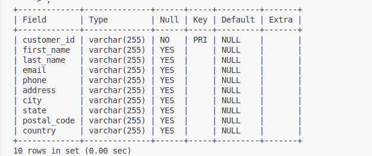
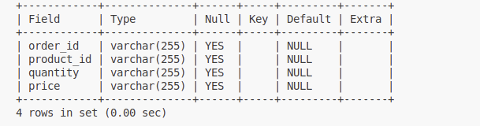
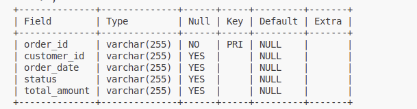
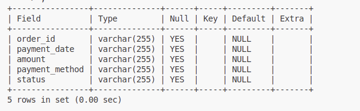
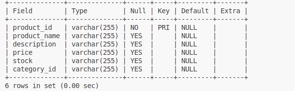
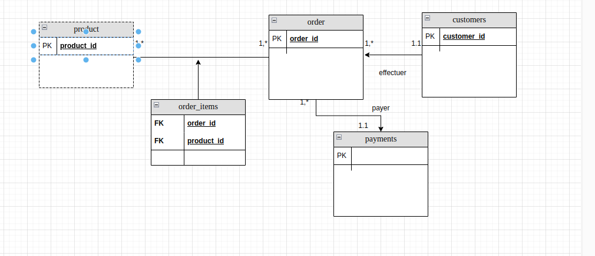

question 1 : 
    choisir la database : use kinternship2025;
    puis afficher les tables : show tables;
    puis afficher la description de chaque table: describe customers;
    
    describe order_items;
    
    describe orders;
    
    describe payments;
    
    describe products;
    
question2:
les relations entre les tables : 
    une relation entre la table "customers" et "orders" c'est une relation one-to-many càd un client peut effectuer une à plusieurs commandes 
    une relation entre order et products c'est une relation many-to-many ce qui nous a generer une table association "order_items"
    une relation entre la table order et payment c'est une relation one to many 
    NB: la table payment n'a pas une cle principale et order_id est une clé etrangere de la table payment 
question3 :
